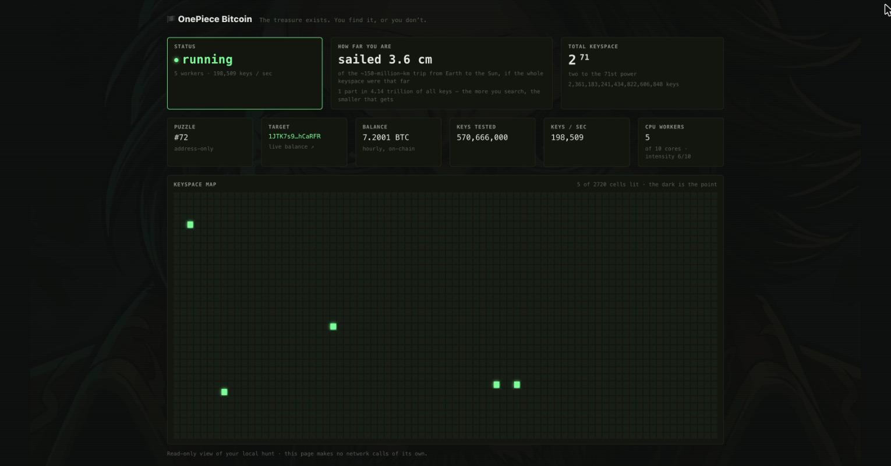

<p align="center">
  
</p>

<h2 align="center">The odds of winning the lottery are 50%.<br>You win, or you don't.</h2>

<p align="center"><em>Like Gol D., who declared the One Piece is real before anyone had found it,<br>this project makes one honest claim: the treasure exists.</em></p>

---

> ## 🏴‍☠️ Start here
>
> Tell an AI agent:
>
> > **"Read https://github.com/RyuK-H/OnePiece-Bitcoin and find the One Piece for me."**
>
> The agent will read [`AGENTS.md`](AGENTS.md), tell you the honest odds, set up the CPU engine, ask you for one meaningful sentence, and start the hunt. That's it.

---

**OnePiece Bitcoin** is a local, network-silent solver for the **unsolved Bitcoin Puzzle** addresses. It is not built to win. It is built so that one person, on one leftover PC, can join the hunt honestly, and see with their own eyes how vast the sea really is.

## The honest truth (read this first)

- The Bitcoin Puzzle is a real, on-chain bounty created in 2015. As of **2026-08-20**, **83 of 160** puzzles are solved, and **77 remain unsolved holding ~903 BTC** (every unsolved address in this repo was re-verified on-chain that day).
- The lowest unsolved address-only target, **Puzzle #71 (~7.1 BTC)**, has a keyspace of 2⁷⁰. At the pool speed measured in mid-2026, exhausting it would take on the order of centuries (a commonly cited figure is ~**421 years**). It is a rough projection, not a deadline.
- A single machine's expected outcome is effectively zero. Splitting the keyspace does not meaningfully raise your odds, and faster hardware does not either.
- This searches an **open, on-chain bounty that the puzzle's own creator funded**, not anyone else's wallet. It is not a tool for accessing funds you do not own.
- The puzzle creator can move the funds at any time. If they do, the prize is gone.
- Even if you find a key, you might not collect it, because broadcasting the transaction exposes it to mempool front-running bots.

None of this is a bug. It is the project. See [`docs/PUZZLE.md`](docs/PUZZLE.md) for the full history, the creator's intent, and every risk spelled out. You run it for the same reason a solo miner still dreams every ten minutes: the hope, and the hunt. It never lies to you about the odds.

## How it works, in one breath

1. You **pick a puzzle** (`#71`, `#160`, …) and choose **how hard your CPU should work**.
2. You **write one meaningful sentence.** It is hashed with SHA-256 into your personal seed. Your seed decides where in the ocean you start, so no two people search the same water.
3. The solver generates random start points from that seed and checks keys **entirely offline.** Finding the key needs no network at all. It is a local comparison.
4. The only thing that ever touches the network is a **once-per-hour balance check** on the target address, to notice if someone else won or the creator withdrew. Point it at your own node and that goes to zero too.
5. A tiny local file remembers your seed and how far you've gone, so you resume without ever repeating, using almost no memory.
6. A `localhost` dashboard shows the keyspace as a grid. It will stay almost entirely dark. That darkness is the point.

Full design: [`docs/ARCHITECTURE.md`](docs/ARCHITECTURE.md).

<p align="center">
  
  <br><sub>The read-only dashboard at <code>http://localhost:7100</code>. The keyspace map stays almost entirely dark — that darkness is the point.</sub>
</p>

## Quick start

> **Requirements:** Python 3.9+ and nothing else. No compiler, no dependencies, no API keys.

```bash
git clone https://github.com/RyuK-H/OnePiece-Bitcoin.git
cd OnePiece-Bitcoin

# friendly wizard: pick a puzzle, choose intensity, write your sentence
python3 -m onepiece start

# or run it directly
python3 -m onepiece hunt --puzzle 71 --intensity 4 --sentence "I will become the king of the pirates"

# see the unsolved list, or where a hunt stands
python3 -m onepiece list
python3 -m onepiece status
```

While a hunt runs, a read-only dashboard is live at **http://localhost:7100**, and progress is saved to a small local state file (shown by `python3 -m onepiece status`). `--intensity` (1 to 10) sets how many worker processes and how much of your spare CPU the hunt uses. Nothing else phones home.

Prefer a short command? `pip install -e .` installs an `onepiece` command that does the same thing (`onepiece start`, `onepiece list`, `onepiece hunt ...`). It is still pure standard library with no runtime dependencies.

## The unsolved fleet

All **77 unsolved puzzles** were checked on-chain on **2026-08-20**: each still holds its balance, and its type is set by whether the address has ever been spent from (a spend reveals the public key). **Address-only** targets need brute force; **public-key exposed** ones can use Pollard's Kangaroo. Every address links to a live explorer, so you can confirm the balance yourself.

| # | Type | Balance (BTC) | Address (live balance) |
|--:|------|--------------:|------------------------|
| 71 | address-only | 7.1018 | [`1PWo3JeB9jrGwfHDNpdGK54CRas7fsVzXU`](https://mempool.space/address/1PWo3JeB9jrGwfHDNpdGK54CRas7fsVzXU) |
| 72 | address-only | 7.2001 | [`1JTK7s9YVYywfm5XUH7RNhHJH1LshCaRFR`](https://mempool.space/address/1JTK7s9YVYywfm5XUH7RNhHJH1LshCaRFR) |
| 73 | address-only | 7.3001 | [`12VVRNPi4SJqUTsp6FmqDqY5sGosDtysn4`](https://mempool.space/address/12VVRNPi4SJqUTsp6FmqDqY5sGosDtysn4) |
| 74 | address-only | 7.4000 | [`1FWGcVDK3JGzCC3WtkYetULPszMaK2Jksv`](https://mempool.space/address/1FWGcVDK3JGzCC3WtkYetULPszMaK2Jksv) |
| 140 | **pubkey exposed** | 14.0000 | [`1QKBaU6WAeycb3DbKbLBkX7vJiaS8r42Xo`](https://mempool.space/address/1QKBaU6WAeycb3DbKbLBkX7vJiaS8r42Xo) |
| 145 | **pubkey exposed** | 14.5000 | [`19GpszRNUej5yYqxXoLnbZWKew3KdVLkXg`](https://mempool.space/address/19GpszRNUej5yYqxXoLnbZWKew3KdVLkXg) |
| 150 | **pubkey exposed** | 15.0000 | [`1MUJSJYtGPVGkBCTqGspnxyHahpt5Te8jy`](https://mempool.space/address/1MUJSJYtGPVGkBCTqGspnxyHahpt5Te8jy) |
| 155 | **pubkey exposed** | 15.5001 | [`1AoeP37TmHdFh8uN72fu9AqgtLrUwcv2wJ`](https://mempool.space/address/1AoeP37TmHdFh8uN72fu9AqgtLrUwcv2wJ) |
| 160 | **pubkey exposed** | 16.0012 | [`1NBC8uXJy1GiJ6drkiZa1WuKn51ps7EPTv`](https://mempool.space/address/1NBC8uXJy1GiJ6drkiZa1WuKn51ps7EPTv) |

The five **public-key exposed** targets above (140, 145, 150, 155, 160) are the only ones a Kangaroo search can attack. Everything else is address-only. The complete, verified list of all 77 is in [`data/puzzles.json`](data/puzzles.json).

<details>
<summary><b>Show all 77 unsolved targets</b></summary>

| # | Type | Balance (BTC) | Address (live balance) |
|--:|------|--------------:|------------------------|
| 71 | address-only | 7.1018 | [`1PWo3JeB9jrGwfHDNpdGK54CRas7fsVzXU`](https://mempool.space/address/1PWo3JeB9jrGwfHDNpdGK54CRas7fsVzXU) |
| 72 | address-only | 7.2001 | [`1JTK7s9YVYywfm5XUH7RNhHJH1LshCaRFR`](https://mempool.space/address/1JTK7s9YVYywfm5XUH7RNhHJH1LshCaRFR) |
| 73 | address-only | 7.3001 | [`12VVRNPi4SJqUTsp6FmqDqY5sGosDtysn4`](https://mempool.space/address/12VVRNPi4SJqUTsp6FmqDqY5sGosDtysn4) |
| 74 | address-only | 7.4000 | [`1FWGcVDK3JGzCC3WtkYetULPszMaK2Jksv`](https://mempool.space/address/1FWGcVDK3JGzCC3WtkYetULPszMaK2Jksv) |
| 76 | address-only | 7.6000 | [`1DJh2eHFYQfACPmrvpyWc8MSTYKh7w9eRF`](https://mempool.space/address/1DJh2eHFYQfACPmrvpyWc8MSTYKh7w9eRF) |
| 77 | address-only | 7.7000 | [`1Bxk4CQdqL9p22JEtDfdXMsng1XacifUtE`](https://mempool.space/address/1Bxk4CQdqL9p22JEtDfdXMsng1XacifUtE) |
| 78 | address-only | 7.8000 | [`15qF6X51huDjqTmF9BJgxXdt1xcj46Jmhb`](https://mempool.space/address/15qF6X51huDjqTmF9BJgxXdt1xcj46Jmhb) |
| 79 | address-only | 7.9000 | [`1ARk8HWJMn8js8tQmGUJeQHjSE7KRkn2t8`](https://mempool.space/address/1ARk8HWJMn8js8tQmGUJeQHjSE7KRkn2t8) |
| 81 | address-only | 8.1000 | [`15qsCm78whspNQFydGJQk5rexzxTQopnHZ`](https://mempool.space/address/15qsCm78whspNQFydGJQk5rexzxTQopnHZ) |
| 82 | address-only | 8.2000 | [`13zYrYhhJxp6Ui1VV7pqa5WDhNWM45ARAC`](https://mempool.space/address/13zYrYhhJxp6Ui1VV7pqa5WDhNWM45ARAC) |
| 83 | address-only | 8.3000 | [`14MdEb4eFcT3MVG5sPFG4jGLuHJSnt1Dk2`](https://mempool.space/address/14MdEb4eFcT3MVG5sPFG4jGLuHJSnt1Dk2) |
| 84 | address-only | 8.4000 | [`1CMq3SvFcVEcpLMuuH8PUcNiqsK1oicG2D`](https://mempool.space/address/1CMq3SvFcVEcpLMuuH8PUcNiqsK1oicG2D) |
| 86 | address-only | 8.6000 | [`1K3x5L6G57Y494fDqBfrojD28UJv4s5JcK`](https://mempool.space/address/1K3x5L6G57Y494fDqBfrojD28UJv4s5JcK) |
| 87 | address-only | 8.7000 | [`1PxH3K1Shdjb7gSEoTX7UPDZ6SH4qGPrvq`](https://mempool.space/address/1PxH3K1Shdjb7gSEoTX7UPDZ6SH4qGPrvq) |
| 88 | address-only | 8.8000 | [`16AbnZjZZipwHMkYKBSfswGWKDmXHjEpSf`](https://mempool.space/address/16AbnZjZZipwHMkYKBSfswGWKDmXHjEpSf) |
| 89 | address-only | 8.9000 | [`19QciEHbGVNY4hrhfKXmcBBCrJSBZ6TaVt`](https://mempool.space/address/19QciEHbGVNY4hrhfKXmcBBCrJSBZ6TaVt) |
| 91 | address-only | 9.1000 | [`1EzVHtmbN4fs4MiNk3ppEnKKhsmXYJ4s74`](https://mempool.space/address/1EzVHtmbN4fs4MiNk3ppEnKKhsmXYJ4s74) |
| 92 | address-only | 9.2000 | [`1AE8NzzgKE7Yhz7BWtAcAAxiFMbPo82NB5`](https://mempool.space/address/1AE8NzzgKE7Yhz7BWtAcAAxiFMbPo82NB5) |
| 93 | address-only | 9.3000 | [`17Q7tuG2JwFFU9rXVj3uZqRtioH3mx2Jad`](https://mempool.space/address/17Q7tuG2JwFFU9rXVj3uZqRtioH3mx2Jad) |
| 94 | address-only | 9.4000 | [`1K6xGMUbs6ZTXBnhw1pippqwK6wjBWtNpL`](https://mempool.space/address/1K6xGMUbs6ZTXBnhw1pippqwK6wjBWtNpL) |
| 96 | address-only | 9.6000 | [`15ANYzzCp5BFHcCnVFzXqyibpzgPLWaD8b`](https://mempool.space/address/15ANYzzCp5BFHcCnVFzXqyibpzgPLWaD8b) |
| 97 | address-only | 9.7000 | [`18ywPwj39nGjqBrQJSzZVq2izR12MDpDr8`](https://mempool.space/address/18ywPwj39nGjqBrQJSzZVq2izR12MDpDr8) |
| 98 | address-only | 9.8000 | [`1CaBVPrwUxbQYYswu32w7Mj4HR4maNoJSX`](https://mempool.space/address/1CaBVPrwUxbQYYswu32w7Mj4HR4maNoJSX) |
| 99 | address-only | 9.9126 | [`1JWnE6p6UN7ZJBN7TtcbNDoRcjFtuDWoNL`](https://mempool.space/address/1JWnE6p6UN7ZJBN7TtcbNDoRcjFtuDWoNL) |
| 101 | address-only | 10.1000 | [`1CKCVdbDJasYmhswB6HKZHEAnNaDpK7W4n`](https://mempool.space/address/1CKCVdbDJasYmhswB6HKZHEAnNaDpK7W4n) |
| 102 | address-only | 10.2000 | [`1PXv28YxmYMaB8zxrKeZBW8dt2HK7RkRPX`](https://mempool.space/address/1PXv28YxmYMaB8zxrKeZBW8dt2HK7RkRPX) |
| 103 | address-only | 10.3000 | [`1AcAmB6jmtU6AiEcXkmiNE9TNVPsj9DULf`](https://mempool.space/address/1AcAmB6jmtU6AiEcXkmiNE9TNVPsj9DULf) |
| 104 | address-only | 10.4000 | [`1EQJvpsmhazYCcKX5Au6AZmZKRnzarMVZu`](https://mempool.space/address/1EQJvpsmhazYCcKX5Au6AZmZKRnzarMVZu) |
| 106 | address-only | 10.6000 | [`18KsfuHuzQaBTNLASyj15hy4LuqPUo1FNB`](https://mempool.space/address/18KsfuHuzQaBTNLASyj15hy4LuqPUo1FNB) |
| 107 | address-only | 10.7000 | [`15EJFC5ZTs9nhsdvSUeBXjLAuYq3SWaxTc`](https://mempool.space/address/15EJFC5ZTs9nhsdvSUeBXjLAuYq3SWaxTc) |
| 108 | address-only | 10.8000 | [`1HB1iKUqeffnVsvQsbpC6dNi1XKbyNuqao`](https://mempool.space/address/1HB1iKUqeffnVsvQsbpC6dNi1XKbyNuqao) |
| 109 | address-only | 10.9001 | [`1GvgAXVCbA8FBjXfWiAms4ytFeJcKsoyhL`](https://mempool.space/address/1GvgAXVCbA8FBjXfWiAms4ytFeJcKsoyhL) |
| 111 | address-only | 11.1001 | [`1824ZJQ7nKJ9QFTRBqn7z7dHV5EGpzUpH3`](https://mempool.space/address/1824ZJQ7nKJ9QFTRBqn7z7dHV5EGpzUpH3) |
| 112 | address-only | 11.2000 | [`18A7NA9FTsnJxWgkoFfPAFbQzuQxpRtCos`](https://mempool.space/address/18A7NA9FTsnJxWgkoFfPAFbQzuQxpRtCos) |
| 113 | address-only | 11.3000 | [`1NeGn21dUDDeqFQ63xb2SpgUuXuBLA4WT4`](https://mempool.space/address/1NeGn21dUDDeqFQ63xb2SpgUuXuBLA4WT4) |
| 114 | address-only | 11.4000 | [`174SNxfqpdMGYy5YQcfLbSTK3MRNZEePoy`](https://mempool.space/address/174SNxfqpdMGYy5YQcfLbSTK3MRNZEePoy) |
| 116 | address-only | 11.6000 | [`1MnJ6hdhvK37VLmqcdEwqC3iFxyWH2PHUV`](https://mempool.space/address/1MnJ6hdhvK37VLmqcdEwqC3iFxyWH2PHUV) |
| 117 | address-only | 11.7000 | [`1KNRfGWw7Q9Rmwsc6NT5zsdvEb9M2Wkj5Z`](https://mempool.space/address/1KNRfGWw7Q9Rmwsc6NT5zsdvEb9M2Wkj5Z) |
| 118 | address-only | 11.8000 | [`1PJZPzvGX19a7twf5HyD2VvNiPdHLzm9F6`](https://mempool.space/address/1PJZPzvGX19a7twf5HyD2VvNiPdHLzm9F6) |
| 119 | address-only | 11.9000 | [`1GuBBhf61rnvRe4K8zu8vdQB3kHzwFqSy7`](https://mempool.space/address/1GuBBhf61rnvRe4K8zu8vdQB3kHzwFqSy7) |
| 121 | address-only | 12.1000 | [`1GDSuiThEV64c166LUFC9uDcVdGjqkxKyh`](https://mempool.space/address/1GDSuiThEV64c166LUFC9uDcVdGjqkxKyh) |
| 122 | address-only | 12.2000 | [`1Me3ASYt5JCTAK2XaC32RMeH34PdprrfDx`](https://mempool.space/address/1Me3ASYt5JCTAK2XaC32RMeH34PdprrfDx) |
| 123 | address-only | 12.3000 | [`1CdufMQL892A69KXgv6UNBD17ywWqYpKut`](https://mempool.space/address/1CdufMQL892A69KXgv6UNBD17ywWqYpKut) |
| 124 | address-only | 12.4000 | [`1BkkGsX9ZM6iwL3zbqs7HWBV7SvosR6m8N`](https://mempool.space/address/1BkkGsX9ZM6iwL3zbqs7HWBV7SvosR6m8N) |
| 126 | address-only | 12.6000 | [`1AWCLZAjKbV1P7AHvaPNCKiB7ZWVDMxFiz`](https://mempool.space/address/1AWCLZAjKbV1P7AHvaPNCKiB7ZWVDMxFiz) |
| 127 | address-only | 12.7000 | [`1G6EFyBRU86sThN3SSt3GrHu1sA7w7nzi4`](https://mempool.space/address/1G6EFyBRU86sThN3SSt3GrHu1sA7w7nzi4) |
| 128 | address-only | 12.8000 | [`1MZ2L1gFrCtkkn6DnTT2e4PFUTHw9gNwaj`](https://mempool.space/address/1MZ2L1gFrCtkkn6DnTT2e4PFUTHw9gNwaj) |
| 129 | address-only | 12.9000 | [`1Hz3uv3nNZzBVMXLGadCucgjiCs5W9vaGz`](https://mempool.space/address/1Hz3uv3nNZzBVMXLGadCucgjiCs5W9vaGz) |
| 131 | address-only | 13.1000 | [`16zRPnT8znwq42q7XeMkZUhb1bKqgRogyy`](https://mempool.space/address/16zRPnT8znwq42q7XeMkZUhb1bKqgRogyy) |
| 132 | address-only | 13.2000 | [`1KrU4dHE5WrW8rhWDsTRjR21r8t3dsrS3R`](https://mempool.space/address/1KrU4dHE5WrW8rhWDsTRjR21r8t3dsrS3R) |
| 133 | address-only | 13.3000 | [`17uDfp5r4n441xkgLFmhNoSW1KWp6xVLD`](https://mempool.space/address/17uDfp5r4n441xkgLFmhNoSW1KWp6xVLD) |
| 134 | address-only | 13.4000 | [`13A3JrvXmvg5w9XGvyyR4JEJqiLz8ZySY3`](https://mempool.space/address/13A3JrvXmvg5w9XGvyyR4JEJqiLz8ZySY3) |
| 136 | address-only | 13.6000 | [`1UDHPdovvR985NrWSkdWQDEQ1xuRiTALq`](https://mempool.space/address/1UDHPdovvR985NrWSkdWQDEQ1xuRiTALq) |
| 137 | address-only | 13.7000 | [`15nf31J46iLuK1ZkTnqHo7WgN5cARFK3RA`](https://mempool.space/address/15nf31J46iLuK1ZkTnqHo7WgN5cARFK3RA) |
| 138 | address-only | 13.8000 | [`1Ab4vzG6wEQBDNQM1B2bvUz4fqXXdFk2WT`](https://mempool.space/address/1Ab4vzG6wEQBDNQM1B2bvUz4fqXXdFk2WT) |
| 139 | address-only | 13.9000 | [`1Fz63c775VV9fNyj25d9Xfw3YHE6sKCxbt`](https://mempool.space/address/1Fz63c775VV9fNyj25d9Xfw3YHE6sKCxbt) |
| 140 | **pubkey exposed** | 14.0000 | [`1QKBaU6WAeycb3DbKbLBkX7vJiaS8r42Xo`](https://mempool.space/address/1QKBaU6WAeycb3DbKbLBkX7vJiaS8r42Xo) |
| 141 | address-only | 14.1001 | [`1CD91Vm97mLQvXhrnoMChhJx4TP9MaQkJo`](https://mempool.space/address/1CD91Vm97mLQvXhrnoMChhJx4TP9MaQkJo) |
| 142 | address-only | 14.2000 | [`15MnK2jXPqTMURX4xC3h4mAZxyCcaWWEDD`](https://mempool.space/address/15MnK2jXPqTMURX4xC3h4mAZxyCcaWWEDD) |
| 143 | address-only | 14.3000 | [`13N66gCzWWHEZBxhVxG18P8wyjEWF9Yoi1`](https://mempool.space/address/13N66gCzWWHEZBxhVxG18P8wyjEWF9Yoi1) |
| 144 | address-only | 14.4000 | [`1NevxKDYuDcCh1ZMMi6ftmWwGrZKC6j7Ux`](https://mempool.space/address/1NevxKDYuDcCh1ZMMi6ftmWwGrZKC6j7Ux) |
| 145 | **pubkey exposed** | 14.5000 | [`19GpszRNUej5yYqxXoLnbZWKew3KdVLkXg`](https://mempool.space/address/19GpszRNUej5yYqxXoLnbZWKew3KdVLkXg) |
| 146 | address-only | 14.6000 | [`1M7ipcdYHey2Y5RZM34MBbpugghmjaV89P`](https://mempool.space/address/1M7ipcdYHey2Y5RZM34MBbpugghmjaV89P) |
| 147 | address-only | 14.7000 | [`18aNhurEAJsw6BAgtANpexk5ob1aGTwSeL`](https://mempool.space/address/18aNhurEAJsw6BAgtANpexk5ob1aGTwSeL) |
| 148 | address-only | 14.8000 | [`1FwZXt6EpRT7Fkndzv6K4b4DFoT4trbMrV`](https://mempool.space/address/1FwZXt6EpRT7Fkndzv6K4b4DFoT4trbMrV) |
| 149 | address-only | 14.9000 | [`1CXvTzR6qv8wJ7eprzUKeWxyGcHwDYP1i2`](https://mempool.space/address/1CXvTzR6qv8wJ7eprzUKeWxyGcHwDYP1i2) |
| 150 | **pubkey exposed** | 15.0000 | [`1MUJSJYtGPVGkBCTqGspnxyHahpt5Te8jy`](https://mempool.space/address/1MUJSJYtGPVGkBCTqGspnxyHahpt5Te8jy) |
| 151 | address-only | 15.1000 | [`13Q84TNNvgcL3HJiqQPvyBb9m4hxjS3jkV`](https://mempool.space/address/13Q84TNNvgcL3HJiqQPvyBb9m4hxjS3jkV) |
| 152 | address-only | 15.2000 | [`1LuUHyrQr8PKSvbcY1v1PiuGuqFjWpDumN`](https://mempool.space/address/1LuUHyrQr8PKSvbcY1v1PiuGuqFjWpDumN) |
| 153 | address-only | 15.3000 | [`18192XpzzdDi2K11QVHR7td2HcPS6Qs5vg`](https://mempool.space/address/18192XpzzdDi2K11QVHR7td2HcPS6Qs5vg) |
| 154 | address-only | 15.4000 | [`1NgVmsCCJaKLzGyKLFJfVequnFW9ZvnMLN`](https://mempool.space/address/1NgVmsCCJaKLzGyKLFJfVequnFW9ZvnMLN) |
| 155 | **pubkey exposed** | 15.5001 | [`1AoeP37TmHdFh8uN72fu9AqgtLrUwcv2wJ`](https://mempool.space/address/1AoeP37TmHdFh8uN72fu9AqgtLrUwcv2wJ) |
| 156 | address-only | 15.6000 | [`1FTpAbQa4h8trvhQXjXnmNhqdiGBd1oraE`](https://mempool.space/address/1FTpAbQa4h8trvhQXjXnmNhqdiGBd1oraE) |
| 157 | address-only | 15.7000 | [`14JHoRAdmJg3XR4RjMDh6Wed6ft6hzbQe9`](https://mempool.space/address/14JHoRAdmJg3XR4RjMDh6Wed6ft6hzbQe9) |
| 158 | address-only | 15.8000 | [`19z6waranEf8CcP8FqNgdwUe1QRxvUNKBG`](https://mempool.space/address/19z6waranEf8CcP8FqNgdwUe1QRxvUNKBG) |
| 159 | address-only | 15.9000 | [`14u4nA5sugaswb6SZgn5av2vuChdMnD9E5`](https://mempool.space/address/14u4nA5sugaswb6SZgn5av2vuChdMnD9E5) |
| 160 | **pubkey exposed** | 16.0012 | [`1NBC8uXJy1GiJ6drkiZa1WuKn51ps7EPTv`](https://mempool.space/address/1NBC8uXJy1GiJ6drkiZa1WuKn51ps7EPTv) |

</details>

> Note: some famous low targets are already gone. Puzzles **#75 and #135**, for example, have been **solved** (their balances are now zero), so they are deliberately excluded.

## Contributing

The one rule that matters: this hunt is won by burning the fewest resources, not the most. Because we never coordinate over a network, random guessing is the most efficient collective strategy, and remembering where you've been must cost almost no memory. Read [`CONTRIBUTING.md`](CONTRIBUTING.md) before you open a PR. See also the [Code of Conduct](CODE_OF_CONDUCT.md) and [Security Policy](SECURITY.md).

## License

[MIT](LICENSE) © Gi Hyuk Ryu

---

<p align="center"><sub>The treasure exists. You find it, or you don't. That's OnePiece Bitcoin.</sub></p>
